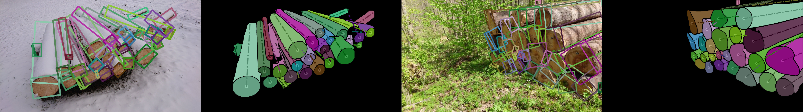

# TimberVision



TimberVision is a dataset and framework for tree-trunk detection and tracking based on RGB images. It combines the advantages of oriented object detection and instance segmentation for optimizing robustness and efficiency, as described in the corresponding [paper](https://arxiv.org/pdf/2501.07360v1) and [poster](./figures/timbervision_poster.pdf) presented at WACV 2025. This repository contains source code, models, configuration files and documentation. Images and annotations of the TimberVision dataset are available [here](https://zenodo.org/records/14825846).


## Setup

To run any source code, clone this repository and create a conda environment using [requirements.txt](./requirements.txt).

    conda create -n timbervision python=3.11
    conda activate timbervision
    pip install -r requirements.txt

## Usage

The framework includes multiple python scripts for demonstration, evaluation and utility functions, which are summarized below. Calling any script with `-h` in the command line will display a more detailed help message including a list of available parameters.

### Demo application and performance evaluation

The demo and evaluation scripts require trained models for oriented object detection and instance segmentation compatible with [YOLOv8](https://docs.ultralytics.com/models/yolov8/). If they are not specified as arguments, default models will automatically be downloaded into a subdirectory of [fusion](./fusion). Otherwise, their locations can be provided as absolute or relative paths, as well as file names found in the default directory. For usage with custom models trained on class ids different from the defaults, the `CUT`, `SIDE` and `TRUNK` values in [detector.py](./fusion/detector.py) need to be adapted accordingly. 

[demo.py](demo.py) provides a demonstrator for detection and fusion with optional tracking on arbitrary image or video data. Only input and output paths are required to run the detector with default models and configurations. Tracking has to be explicitly enabled. Depending on the arguments, the output for each frame is either a visualization of obbs and instance-segmentation contours along with geometric features or a single-channel mask encoding class labels and object ids.

[eval_fusion.py](./eval_fusion.py) runs the detector and provides a quantitative evaluation of fused oriented-object-detection and instance-segmentation results by applying YOLO metrics to the oriented bounding boxes of consolidated trunk instances. As inputs, an image directory and corresponding ground-truth annotations in YOLOv8 instance-segmentation format are required.

[eval_mot.py](./eval_mot.py) runs the tracker and provides a quantitative evaluation of multi-object-tracking performance across multiple image sequences with keyframes annotated in a custom csv format (e.g. generated by [extract_instances.py](./utils/extract_instances.py)). Applied metrics include ClearMOT and ID as provided by [py-motmetrics](https://github.com/cheind/py-motmetrics). Results are stored as a csv file in the current directory.

### Dataset utilities

The [utils](./utils) directory contains multiple modules for converting annotations and input data, as well as generating visualizations and statistics.

* [calculate_stats.py](./utils/calculate_stats.py) generates dataset statistics based on YOLOv8 instance-segmentation annotations and corresponding images with optional filtering. They include per-class distributions of instance sizes, orientations and subset associations, as well as overall image resolutions, along with heat-map visualizations of normalized instance positions.

* [extract_instances.py](./utils/extract_instances.py) represents the algorithm used to convert the original [Scalabel](http://www.scalabel.ai/) annotations of the TimberVision dataset to multiple supported formats. They include multiple YOLOv8 formats, as well as custom ones for tracking evaluation. Note that both oriented-object-detection and instance-segmentation models used in this project are trained on YOLOv8 instance-segmentation annotations, as they are compatible with both and less restrictive regarding clipped objects compared to the official format for oriented bounding boxes.

* [visualize_instances.py](./utils/visualize_instances.py) can be used to visualize any annotation format generated by the [annotation-conversion script](./utils/extract_instances.py) with adaptable output sizes and optional filtering.

* [extract_keyframes.py](./utils/extract_keyframes.py) can be used to sample keyframes from arbitrary video files at a given framerate (e.g. for [tracking evaluation](./eval_mot.py)).

* [convert_coco.py](./utils/convert_coco.py) converts third-party annotations in coco format to the YOLOv8 instance-segmentation format used for training and evaluation throughout the TimberVision framework. Optionally, an adapted format supporting multi-part contours compatible with [tracking evaluation](./eval_mot.py) (but not model training) can be generated.

## License

This work is licensed under a [Creative Commons Attribution-NonCommercial-ShareAlike 4.0 International License](http://creativecommons.org/licenses/by-nc-sa/4.0/).

[![CC BY-NC-SA 4.0][cc-by-nc-sa-image]][cc-by-nc-sa]

[cc-by-nc-sa]: http://creativecommons.org/licenses/by-nc-sa/4.0/
[cc-by-nc-sa-image]: https://licensebuttons.net/l/by-nc-sa/4.0/88x31.png

## Citing
If you use the TimberVision dataset or framework for your research, please use the following BibTeX entry:

```BibTeX
@InProceedings{Steininger_2025_WACV,
    author    = {Steininger, Daniel and Simon, Julia and Trondl, Andreas and Murschitz, Markus},
    title     = {TimberVision: A Multi-Task Dataset and Framework for Log-Component Segmentation and Tracking in Autonomous Forestry Operations},
    booktitle = {Proceedings of the IEEE/CVF Winter Conference on Applications of Computer Vision (WACV)},
    month     = {March},
    year      = {2025}
}
```
